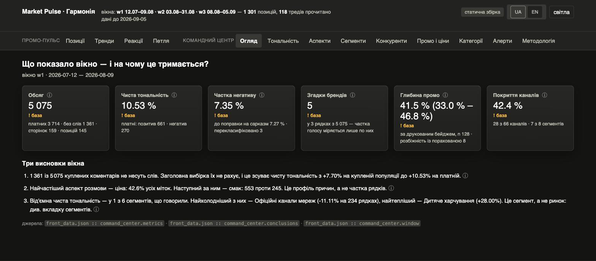
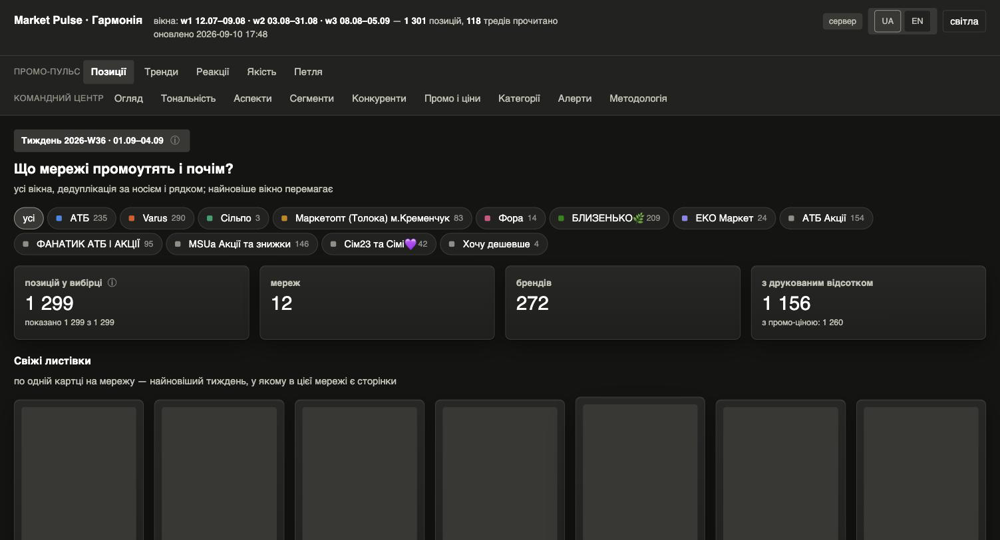
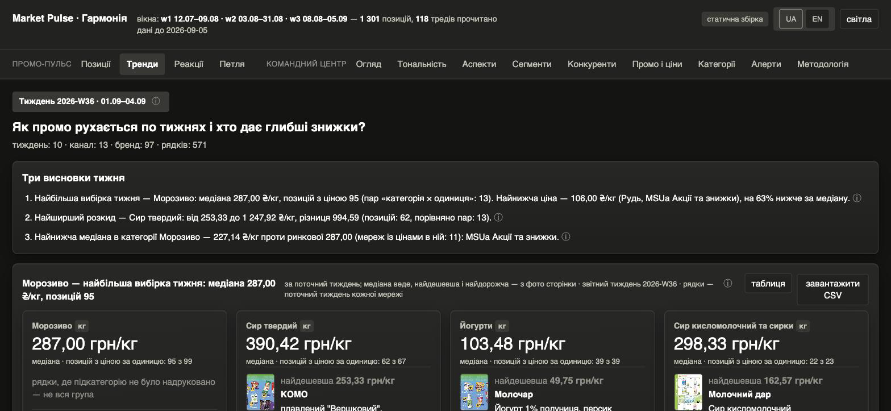
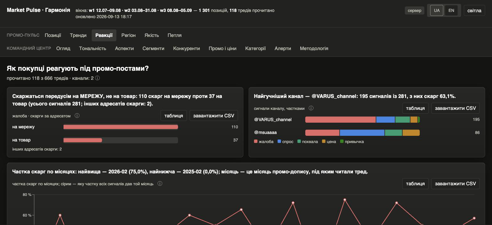
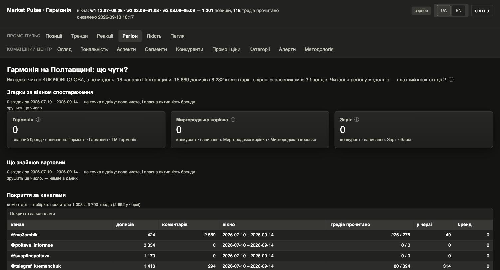
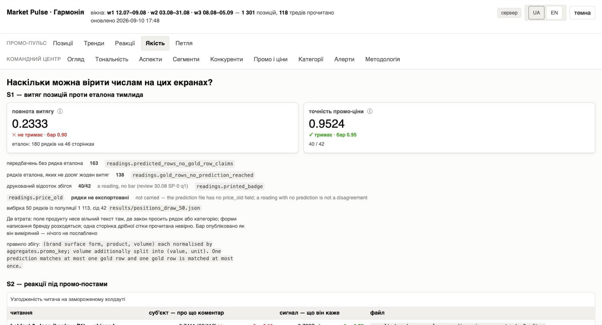
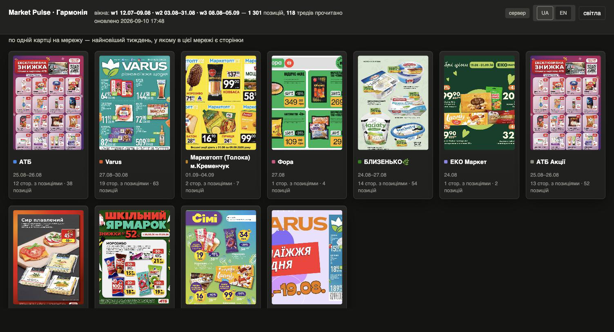

# Market Pulse — the category radar for a Ukrainian dairy brand

A marketing-research instrument, not a demo. It watches the Telegram channels of Ukrainian retail
chains and the chats of one home region, reads the promo leaflets those channels publish, and
classifies what buyers say in the comments under promo posts — so a marketing director can answer,
in ten seconds, what the chains are promoting, at what price and depth, and how the market reacts.

**Every figure on the screen is a field of a result file.** The app formats, filters, sorts and
links; it computes no number of its own, and every number can name the file it came from. Where a
figure does not exist, the screen says which nothing it is — «not collected», «not exported» or
«none in the data» — and never prints a zero instead.

**Constraints it was built under:** Telegram only, **$0 data budget**, a local Gemma-4-31B with a
QLoRA adapter on rented GPUs, and no training at all in stage 1.

## The screens

| | |
|---|---|
|  |  |
| **Командний центр · Огляд** — the six headline metrics, each with its context line, status badge and provenance ⓘ. | **Промо · Позиції** — every promo position over all windows, page-true, with the leaflet page behind each row. |
|  |  |
| **Промо · Тренди** — «Три висновки тижня» and the price exhibits, each titled with its own finding. | **Промо · Реакції** — what buyers say under promo posts: service vs product, the signal mix, the voice of the SKU. |
|  |  |
| **Промо · Регіон** — the home region's baseline: a zero printed as a measurement, with the window it was measured over. | **Промо · Якість** — the S1 and S2 bars as measured, red where they are red, with the file behind each. |

The flyer gallery — the real leaflet pages every position is read off:



## Run it

```
pip install -e '.[serve]'   # fastapi + uvicorn, pinned
make serve                  # http://localhost:8000/ — the app and its API, localhost only
make loop                   # the $0 loop: wake on the schedule, tick, one line into results/loop.log
```

`make loop` buys nothing. `data/loop.json :: endpoint` is the operator's own field: the daemon
reads it, says in the log which of the two nothings the queue is, and never starts a paid pass.

To keep the loop running at login, install the launchd template — the executor never does this:

```
sed -e "s|__REPO__|$PWD|g" \
    -e "s|__PYTHON__|$(python3.11 -c 'import sys; print(sys.executable)')|g" \
    ops/com.marketpulse.loop.plist > ~/Library/LaunchAgents/com.marketpulse.loop.plist
launchctl load ~/Library/LaunchAgents/com.marketpulse.loop.plist    # unload to stop it
```

## Build and deploy the public showcase

```
make front                  # npm ci && tsc && vite build → dashboard/app/ + data/manifest.json
```

`dashboard/app/` is a build output (gitignored): the same app, reading the exports as files, with
the loop controls read-only. `make front` refuses by name when a result file it needs is missing,
so the build never ships a screen with a hole in it. Deploying is the operator's own command:

```
cp .firebaserc.example .firebaserc     # then put your Firebase project id in it
npx firebase-tools login
npx firebase-tools deploy --only hosting
```

`firebase.json` ships the hosting config (`public: dashboard/app`, SPA rewrite). Build on the
machine that carries the leaflet photos: the flyer JPEGs live under `data/annotation/`, which git
does not carry, and `make front` reports how many of the referenced photos it staged.

## The numbers

<!-- RESULTS — written by scripts/build_readme_results.py from the result files each row names; regenerate with `make promo-screen`, never edit -->
**What the instrument holds today.** Every figure is a field of the file beside it; the app prints these same fields and computes none of them.

| what | value | file :: field |
|---|---|---|
| promo positions on the screen | 1301 | `results/promo_screen_data.json` :: screen.positions |
| positions in the table, page-true | 1299 · 2 excluded (6 corrected by leaflet page) | `results/front_data.json` :: positions |
| promo threads read for reactions | 118 of 666 · 548 queued | `results/front_data.json` :: status.threads |
| signal rows under those threads | 281 | `results/front_data.json` :: reactions_v2 |
| weeks in the committed dataset | 10 (2026-W27–2026-W36) · 1301 rows | `results/weekly/positions_<ISO-week>.jsonl` |
| Poltava-region channels watched | 18 · 15889 posts · 8232 comments | `results/front_data.json` :: region.totals |
| region comment sample | 1008 of 3700 threads · 2692 outstanding | `results/region_collect_report.json` :: totals |
| watchlist mentions in the region | 0 — the baseline, not an empty screen | `results/front_data.json` :: region.baseline |
| money spent on the whole instrument | $8.8398 of the $10.00 cap | `results/spend_cycle3.json` :: sessions[-1] |

**S1 — positions read off leaflet pages, graded on the team lead's blind gold.** The bar is RED and ships RED: the reader finds a quarter of the rows a human finds on the same pages, and prices what it does find.

| reading | value | bar | file |
|---|---|---|---|
| completeness | 0.2333 (42/180) ❌ | 0.90 | `results/grade_positions_50.json` :: bars.completeness |
| promo-price accuracy | 0.9524 (40/42) ✅ | 0.95 | `results/grade_positions_50.json` :: bars.price_accuracy |

Gold rows no prediction reached: 138. Predicted rows no gold row claims: 163. The gold is `docs/labels-positions-50.jsonl`, written blind by the team lead.

**S2 — reactions under promo posts, graded on the frozen holdouts.** Per comment: what it is about (subject, bar 0.80); per thread: what it says (signal types, bar 0.75). Shipped as measured (ruling 06.09 (cc)); every number below is the named file's.

| reading | subject | signal | file |
|---|---|---|---|
| holdout-2 · loop (hooks + P1) — shipped | 0.7411 (83/112) ❌ bar 0.80 | 0.7937 ✅ bar 0.75 | `results/grade_promo_loop_readings.json` :: sets.dev3.after |
| holdout-2 · with P1 — reading | 0.7500 (84/112) ❌ bar 0.80 | 0.8021 ✅ bar 0.75 | `results/grade_promo_p1_readings.json` :: sets.dev3.after |
| holdout-2 · raw — reading | 0.7054 (79/112) ❌ bar 0.80 | 0.8021 ✅ bar 0.75 | `results/grade_promo_holdout2.json` :: whole_40 |
| holdout-40 · raw — reading | 0.7181 (135/188) ❌ bar 0.80 | 0.7958 ✅ bar 0.75 | `results/grade_promo_holdout40.json` :: whole_40 |

The shipped row is the product's pipeline end to end: every answer through the four hooks of §2 S4 — a signal row whose quote is not a substring of the comment it cites is dropped — and then P1. The «with P1» reading beside it is that same layer over the model's RAW answer, one filter upstream, so the two differ by exactly what the hooks drop; the «raw» rows are the reader before P1 at all. A number measured upstream of a product filter is the model's, disclosed as such, never the product's (ruling 08.09 (dd)).

Of the 28 comments «holdout-2 · with P1 — reading» still misses, 16 are rows the gold itself marked `unsure` — the codebook allows two readings there (a store-stock complaint: the chain or the product; a post in the chain's own channel: the chain or the post).

**The model: the fine-tune beside the base it was trained from.** One gold version for every row (v3), so the columns compare; every value is `results/rescores_v3.json`'s own field.

| arm | sentiment macro-F1 | sarcasm fix-rate | intents micro-F1 | post_type macro-F1 | brand F1 |
|---|---|---|---|---|---|
| base — zero-shot, no training | 0.9067 | — | 0.7936 | 0.9190 | 0.9383 |
| fine-tune, real data only | 0.9499 | 0.8182 | 0.8212 | 0.9705 | 0.9744 |
| fine-tune + synthetic sarcasm | 0.9456 | 0.6591 | 0.8073 | 0.9357 | 0.9189 |

The shipped decision was taken at step 4.5h2 пласт ablation on test set v4 — a LATER gold than the table above, so its numbers are not this table's: 3 of 5 gates held (`results/verdict_45h2.json` :: verdicts), and the app's Методологія tab prints the same line. The model is `google/gemma-4-31b-it` + a QLoRA adapter, run on a rented GPU.
<!-- /RESULTS -->

## What it does not do

- **Stage 1 buys no new model reading.** 548 promo threads and the whole regional field are in the
  queue, priced but unbought; the paid pass starts on the operator's word, never on a schedule.
- **The S1 reader is red and ships red.** It finds a quarter of the positions a human finds on the
  same leaflet pages. What it does find, it prices correctly — that is the whole claim.
- **The region's baseline is a zero.** Eighteen Poltava-region channels, no watchlist mention in
  the window: the field is clean, and the zero is the point of reference the brand's own activity
  will move. The comment half of that sweep is a sample of the newest threads per channel, and the
  screen prints how many were read of how many exist.
- **Telegram only.** X, Facebook/Instagram and website monitoring are deferred extensions with no
  code in this repo, and no new source enters without a registry revision.

## Where the truth lives

`docs/PRODUCT.md` — the customer's questions. `docs/SPEC-v2-promo-pulse.md` — the product spec and
its success criteria. `docs/DATASETS.md` — the dataset card: what is collected, where it lands,
what a future model can be trained on. `docs/STATUS.md` — where the work stands.
`docs/reports/ship-1.md` — how this release was verified.

`config/registry.yaml` holds the three registry entities (SPEC §3): **sources** (Telegram channels
per retail chain / aggregator, tagged by `source_type`), **taxonomy** (tracked category groups) and
the brand **watchlist**. New sources, groups and brands are added by editing that file — no code
changes.

```
PYTHONPATH=src python3 -m market_pulse.registry config/registry.yaml
```

## Working on it

```
make check        # ruff check . && pytest -q — the verifier, green after every commit
make session      # the standing prompt for a fresh executor session, printed from docs/PROMPT-standing.md
```

Python 3.11+ with `pytest` and `ruff` (`pip install -e '.[dev]'` in a `.venv`). The suite reads the
local collection store under `data/`, which git does not carry: a fresh clone builds and runs the
product from the committed result files, and the full suite runs where the store lives.
