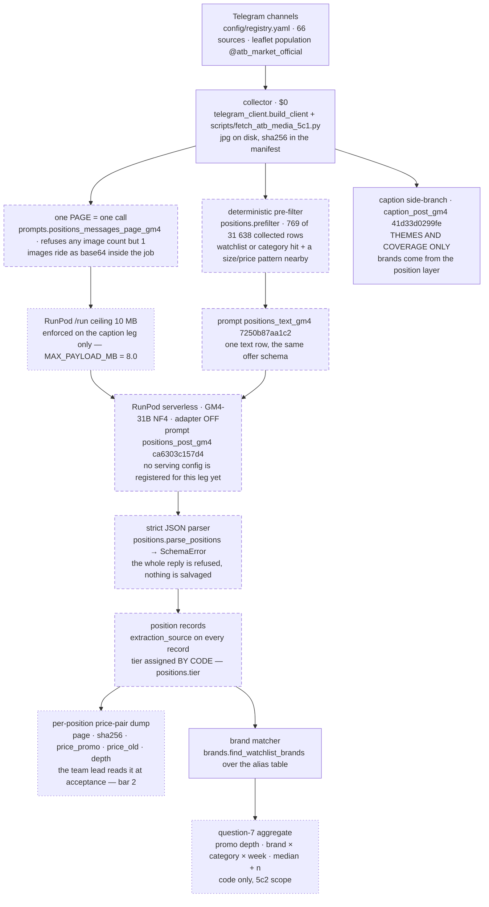
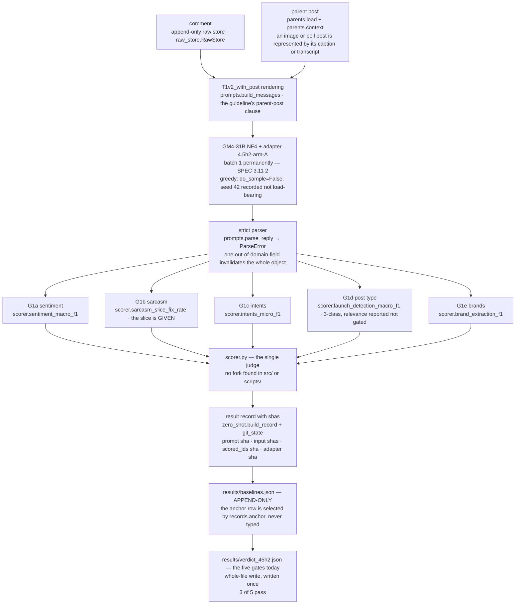

# Architecture — market-pulse-llm

The map of what is built, drawn from the code rather than from the plan. Two flows and one
inventory; nothing here is a decision. The authority for the shape is `docs/SPEC.md` §6 and
amendment 3.17; the authority for what any number means is `results/` and the ADRs in
`knowledge/decisions/`. Where this document and the code disagree, the code is right and this
document is stale — say so and fix the document.

Produced in phase **arch-a** (`docs/PROMPT-arch-a.md`, 2026-08-11, $0). The two node lists are the
team lead's, ratified 10–11.08. They were transcribed and then **verified node by node** against the
repo: 19 nodes, **14 CONFIRMED, 3 DEVIATION, 2 NOT_BUILT**. The command or graph query behind each
verdict is recorded in `implementation-notes.md` under arch-a; the verdicts are on the diagrams and
in the tables below. A node that failed verification is written down as a deviation, never quietly
corrected into something that would draw better.

## How to read the diagrams

| stroke | meaning |
|---|---|
| solid | built and exercised — a test drives it, or a result file was produced by it |
| dashed | built and **never run against money**: the sku-b pilot is its first execution |
| dotted | **not built.** The contract names it; no code writes it today |

A dotted box is not a defect. sku-b is one paid attempt and this phase is the map that precedes it;
two of the eleven Flow-1 nodes are things that attempt has to build, and knowing which two before
the session starts is the point of drawing this.

## Flow 1 — leaflet page → SKU, the sku-b pilot

| # | node | verdict | what the repo actually holds |
|---|---|---|---|
| 1 | Telegram channels | CONFIRMED | `config/registry.yaml` loads 66 sources; `@atb_market_official` is one of them |
| 2 | `telegram_client` collector, jpg + sha on disk, $0 | CONFIRMED | `telegram_client.build_client` refuses to name a person; `scripts/fetch_atb_media_5c1.py` fetches the ATB media and the shas live in the sent-set manifest the leaflet gold pins |
| 3 | one page = one call, base64, ≤ 10 MB | **DEVIATION** | one-image-per-call IS enforced — `prompts.positions_messages_page_gm4` raises for any count but 1, and `tests/test_prompts.py::test_a_page_request_carries_exactly_one_image` drives it with 0, 2 and 6. The **10 MB ceiling is not checked on this leg**: the only numeric guard in the repo is `scripts/caption_gm4_5c1.py::MAX_PAYLOAD_MB = 8.0`. On the positions path the limit is prose in a docstring |
| 4 | RunPod serverless, GM4 NF4, adapter OFF, `positions_post_gm4` | **DEVIATION** | every named part exists and none is wired to positions. `serve_handler.assert_no_adapter` and `serve_handler.settings` refuse a trained-weights environment, but only on the CAPTION path; the worker answers exactly three ops — `info`, `batch`, `caption` — so today's endpoint would refuse a `positions_post_gm4` job outright, and `results/sku_pilot_prereg.json` pins the two prompt shas while registering no serving config at all |
| 5 | strict JSON parser, no salvage | CONFIRMED | `positions.parse_positions` raising `positions.SchemaError`. A different function from Flow 2's `prompts.parse_reply`, and the two refuse each other by name rather than sharing a path |
| 6 | position records: `extraction_source`, tier by code | CONFIRMED | `positions.DECIDED_BY_CODE = (tier, carrier, price_origin, extraction_source, depth, brand_id)` — a model reply carrying any of them is refused |
| 7 | per-position price-pair dump | **NOT BUILT** | no writer exists. Every occurrence of the phrase in the repo is the bar's own wording. What exists is the generic `serve_handler.dump_rows` jsonl and `Position.depth()`; the columns bar 2 is read from have no producer. **sku-b must build it** |
| 8 | brand matcher | CONFIRMED | `brands.find_watchlist_brands` over `brands.watchlist_aliases`; `positions.resolve_brand` maps a read name to a watchlist id or a `raw:` key |
| 9 | question-7 aggregate | **NOT BUILT**, and out of scope | the pre-registration says so itself: no promo aggregate is computed anywhere in sku-b; the rollup is 5c2's. `Position.depth()` and `depth_disagrees_with_printed()` are the ingredients; there is no week bucketing anywhere in `src/` |
| 10 | text leg: `positions.prefilter` → `positions_text_gm4` → the same parser | CONFIRMED | `positions.prefilter(row, compiled, aliases)`; `results/sku_prefilter_census.json` carries the frame of 769 |
| 11 | caption side-branch `caption_post_gm4` | CONFIRMED | the prompt is registered at `41d33d0299fe`; `scripts/caption_gm4_5c1.py` drives it. Its own ADR is the label on the box: a caption is a SAMPLE of a leaflet page |

**The three findings, in one line each.** The 10 MB ceiling is a caption-leg constant that the
positions leg inherits by prose, not by code (Dv113). Today's endpoint would refuse a positions job,
and nothing in the pre-registration pins a serving config for it (Dv114). The dump bar 2 is read
from, and the aggregate question 7 needs, have no producer — one of them is sku-b's to build, the
other is 5c2's (Dv115).

## Flow 2 — comment → five heads, the frozen classification family

| # | node | verdict | what the repo actually holds |
|---|---|---|---|
| 1 | comment + parent post, `parents.py` | CONFIRMED | `parents.load` refuses a store with no posts rather than returning an empty index; `parents.context` is the single rule for what stands in for an image or a poll |
| 2 | `T1v2_with_post` rendering | CONFIRMED | `prompts.build_messages`; the with-post variant is derived from `T1v2` by one clause swap, not retyped |
| 3 | GM4 NF4 + adapter 4.5h2-arm-A, batch 1, greedy | CONFIRMED | adapter identified by sha `b3ca6308…` in the record; batch 1 fixed by SPEC 3.11 (2) after a failed re-measurement; `do_sample=False` in `local_llm` with the amendment cited in the comment beside it |
| 4 | strict parser | CONFIRMED | `prompts.parse_reply` → `ParseError`. A **different** parser from Flow 1's, deliberately: each raises by name if handed the other's task |
| 5 | the five heads in `scorer.py` | CONFIRMED, with a naming note | all five exist and **none raises `NotImplementedError` — the module contains zero occurrences of it**. `launch_detection_macro_f1` is a legacy name for the 3-class post-type score G1d gates; `relevance_macro_f1` sits beside it and is reported, never gated, so it is not a sixth head |
| 6 | `scorer.py` as the single judge | CONFIRMED | no fork. Every gate number in `src/` and `scripts/` comes back through `market_pulse.scorer`, the audit-ceiling column included; the two matchers in `measure_categories.py` produce screen counts and say so in their own record |
| 7 | result files with sha | CONFIRMED | `zero_shot.build_record` assembles; `git_state()` records the commit plus the dirty paths, because a result file cannot name the commit that contains it |
| — | which file anchors the five gates | **DEVIATION** | two files, and they are not interchangeable. The current gate numbers live in `results/verdict_45h2.json`, which is a **whole-file write** — immutable by history (one commit ever) but not by mechanism. The **append-only** file is `results/baselines.json`, from which `records.anchor` selects the bar-setting row and refuses ambiguity rather than first-matching. Drawn as two boxes above for that reason |

## Where the two flows sit inside SPEC §6

SPEC §6 fixes one pipeline: registry → collector → normalize/dedup/lang-id → category relevance
filter → model service → aggregation store → dashboard, behind a source-agnostic connector.
Flow 2 is the model-service half of it, built and measured. Flow 1 is amendment 3.17's addition —
the position layer that answers question 7 — and it is built up to the parser and unbuilt after it.
The aggregation store and the dashboard are Phase 6 and exist in neither flow: `scorer.py` has no
persistence and `scripts/show_results.py` only reads.

# Instrument inventory

Every registered prompt, every file in `scripts/`, every module in `src/market_pulse/`. No sampling
and no merging of rows: the point of an inventory is that a reader can check it is complete, and a
row that was skipped is indistinguishable from a row that does not exist. Counts are at the end.

**Nothing in this phase was deleted, renamed or moved.** The inventory describes the terrain; it
does not move it. Where a row's class is a judgement, the evidence column is what the judgement was
made from, and disagreeing with it costs one grep.

### The five classes

| class | means |
|---|---|
| **battle** | in the live pipeline, or in the phase running now. Touch it and something breaks today |
| **pilot-pending** | built for the sku-b pilot and never run against money. sku-b is its first execution |
| **closed** | *closed by measurement*. Its programme ended in a gate, a verdict or an abort; kept for provenance, because the record it produced is cited by something still live |
| **one-shot** | did one job once — a freeze, a migration, a pack build, a census — and the job is done. Kept, and its artifact is named |
| **candidate-dead** | a **proposal only**. Nothing imports it, no result file or test cites it, and its programme is closed. The operator rules; this phase deletes nothing |

Evidence kinds, in the order they were preferred: a `results/` record the file wrote · a `tests/`
file that imports or drives it · a `knowledge/decisions/` ADR that names it · a git ref. A row whose
strongest evidence is a git ref is a row nothing else in the repo points at, and that is itself
information.

## The 16 registered prompts

`prompts.PROMPTS` has exactly **16** entries. `prompts.RENDER_ONLY` has one:
`precheck_v2ctx_with_post` → `precheck_v2_with_post`. **The twin is one OF the 16, not a
seventeenth** — it shares the prompt text byte for byte, so `prompt_sha256` returns the same
`113000df1995` for both, and what differs is only what the renderer puts around the prompt. A
registry count of 16 and a distinct-sha count of 15 are both correct and mean different things.

| registry key | class | what it is | evidence |
|---|---|---|---|
| `T1` | battle | Frozen v1 zero-shot comment prompt — sentiment / sarcasm / 5 intents; sha 9b2a02178321 | tests/test_prompts.py::test_prompt_hash_matches_the_pre_registered_value pins 9b2a021783212022bb33…; results/parity_s… |
| `T2` | battle | Frozen v1 zero-shot post prompt — relevance / post_type / brands; sha 6a7e66efb3eb | results/verdict_45h2.json |
| `T1v2` | battle | Taxonomy-v2 comment prompt, six intents incl. service, judged on its own text; sha d33ff50dc7bd | results/relabel_45e.json |
| `T1v2_with_post` | battle | The live comment instrument — the v2 prompt with the guideline's parent-post clause; sha 495b43d1361d | results/verdict_45h2.json |
| `T1v2.1` | closed | T1 under taxonomy v2.1 — the v2 prompt plus the eight settled cases stated as negations; sha e131dc0673e9 | results/wave2_45g3_manifest.json and results/rerun_45g3.json pin e131dc0673e9 beside the wave-2 task; the closure is… |
| `T1v2.2` | closed | T1 under taxonomy v2.2 — the same eight rulings said affirmatively (condition → field = value); sha 8542a1d5b37c | results/v22_probe_results.json |
| `relabel_intents_v2` | one-shot | One-field re-labeller: rewrites `intents` only, taxonomy v2, no parent post; sha b54a62ed0982 | results/relabel_45e.json |
| `relabel_intents_v2_with_post` | one-shot | The one-field intents re-labeller with the parent post in the request; sha 5965966d9b98 | results/migration_45h2.json |
| `precheck_v2_with_post` | closed | 4.5g LLM pre-check up-label: four fields incl. `unclear`, parent post rendered; sha 113000df1995 | results/precheck_45g.json |
| `precheck_v2ctx_with_post` | closed | RENDER_ONLY twin of precheck_v2_with_post — same text, two measured facts rendered around it; sha 113000df1995 (identical to its base by design) | results/v2ctx_probe_results.json |
| `precheck_v2.1_with_post` | closed | The wave-2 four-field precheck: v2.1 plus `unclear`, with the parent post; sha 95d506c48a39 | results/rerun_45g3.json |
| `precheck_v2.2_with_post` | closed | The 4.5g4 probe instrument: v2.2 plus `unclear`, with the parent post; sha 02e804b28c48 | results/v22_probe_results.json |
| `caption_post` | one-shot | Paid-API image caption for a media-only post so its comments can be labelled; sha 5dd76ab27fe5 | results/captions_5c1.json (and results/captions_45g2.json) |
| `caption_post_gm4` | battle | The 3.13 caption instrument on the project's own NF4 Gemma-4 base, adapter off; sha 41d33d0299fe | results/captions_gm4_atb19.json |
| `positions_post_gm4` | pilot-pending | One leaflet PAGE → the dairy/ice-cream offers on it, as strict JSON position records; sha ca6303c157d4 | results/sku_pilot_prereg.json |
| `positions_text_gm4` | pilot-pending | One text row (post or comment) → the same offer schema, _swap-derived from the page prompt; sha 7250b87aa1c2 | results/sku_pilot_prereg.json |

## `src/market_pulse/` — 21 modules and the package marker

22 `.py` files: 21 modules plus `__init__.py`. `scorer.py` is the single judge of every gate number
and the sweep found no fork of it anywhere in `src/` or `scripts/`.

| module | class | what it is | evidence |
|---|---|---|---|
| `__init__.py` | battle | Package marker for market_pulse: docstring pointing at docs/SPEC.md plus __version__ = 0.1.0. | git ref 746c1da "Add pyproject and the make check verifier" |
| `annotation.py` | one-shot | Annotation sampling maths, row shapes, label templates and the checker for a filled-in batch. | tests/test_annotation.py (467 lines) imports allocate, stratified_sample, grouped_split, comment_row, post_row, row_s… |
| `audit.py` | one-shot | The 4.5a blind error audit: head/value canon, row blinding, disagreement and control packs, the gold ceiling. | results/audit_45a_manifest.json:94 pins "src/market_pulse/audit.py" as an input of the 244-verdict 4.5a audit pack |
| `backfill.py` | battle | Backfill bookkeeping: the atomic resume cursor (load/save) and the end-of-run per-channel gate summary. | tests/test_backfill.py:14 imports load_cursor, save_cursor, channel_row, total_comments, render_summary from market_p… |
| `brands.py` | battle | Watchlist string matcher: the alias table plus find_watchlist_brands, the cheap G1e prediction baseline. | results/sku_prefilter_census.json:9 names "market_pulse.brands.find_watchlist_brands' rule … the matcher G1e is score… |
| `entry_check.py` | battle | Offline core of the channel entry gate: album collapse, traffic stats, script mix, pre-registered verdict. | results/entry_gate_5c1.json |
| `langid.py` | battle | Heuristic UA/RU/EN guess from alphabet markers plus a frequent-word list; feeds stratification and G1a. | results/language_census_5c1.json:18 records "module": "market_pulse.langid.detect" |
| `local_llm.py` | battle | Local GPU inference: NF4 quantization, model/captioner loaders, LocalClient/CaptionClient, env stamp. | results/parity_srv2.json:99 |
| `loop.py` | battle | Production loop skeleton: two watermarks per channel, plan/ingest, queue depth, the refusal guard. | tests/test_loop.py:14 — `from market_pulse import loop`; a 254-line offline suite that also drives scripts/run_loop.py |
| `parents.py` | battle | Parent-post lookup and `context` — the one rule for what stands in for an image or poll post. | results/image_census_5c1.json:7 — "source": "market_pulse.parents.context — the one rule the labelling passes use" |
| `positions.py` | pilot-pending | Position-layer schema: identity, the 32-cell tier ladder, size/price/fat parsers, prefilter, parser. | results/sku_pilot_prereg.json:67 |
| `prompts.py` | battle | Registered prompt texts and their strict parser; exposes prompt_sha256, build_messages, *_messages_gm4, parse_reply | results/sku_pilot_prereg.json |
| `raw_store.py` | battle | Append-only JSONL raw store (SPEC §6); exposes RawStore, StoreIndex, post_record, comment_record, collapse_albums | tests/test_raw_store.py — 15 tests over the record shapes, the salted sender_anon_id and album collapse |
| `records.py` | battle | Reads results/baselines.json the way a gate must; exposes anchor, arm_record, assert_prompt_sha, slice_ids, artifact_sha256 | results/volume_calc_5c1.json:239 |
| `registry.py` | battle | config/registry.yaml -> frozen Source/Taxonomy/WatchlistBrand; exposes load_registry and the four frozen dataclasses | tests/test_registry.py::test_duplicate_source_id_rejected (line 116) — 17 tests pinning the strict validation |
| `sarcasm.py` | one-shot | Heuristic irony scoring to RANK mining candidates, never to label; exposes signals() and score() | knowledge/decisions/train-recalibration-v2.md:15 |
| `scorer.py` | battle | The single judge of every pre-registered number (SPEC §5); 13 public pure functions, one per gate metric or adoption rule | tests/test_scorer.py::test_every_public_scorer_function_has_a_hand_computed_test (line 342) |
| `serving.py` | battle | RunPod serverless client for the exact production config; exposes EndpointClient, assert_serving, assert_runtime_matches, project_pair_usd | knowledge/decisions/srv2-program-close.md |
| `synthetic.py` | closed | Guards for LLM-generated training rows: word-trigram Jaccard plus frame collapse; exposes closest() and frame_counts() | knowledge/decisions/phase4-gate-verdict.md:110-113 |
| `telegram_client.py` | battle | Telethon client factory from .env (SPEC §2); exposes build_client(), which refuses naming every missing credential | tests/test_telegram_client.py — 3 tests over the missing-variable refusal and the disconnected-client contract |
| `yield_screen.py` | battle | The relevance floor (SPEC 3.12); exposes compile_categories/aliases, category_hits, brand_hits, evidence_line, bar_verdicts | results/yield_screen_5c1.json:4088 names src/market_pulse/yield_screen.py as the producing code; knowledge/decisions/… |
| `zero_shot.py` | battle | OpenRouter HTTP plumbing and budget; exposes routing, request_body, post/get, call_with_retry, Budget, estimate_cost, build_record | tests/test_zero_shot.py |

## `scripts/` — 111 files

98 `.py`, 10 `.md` runbooks, 3 `.sh`. Runbooks are inventoried as instruments because in this repo
they are executable in the only sense that matters: a paid session is driven from one, and
`docs/PROMPT-*.md` cites them as procedure.

| file | class | what it is | evidence |
|---|---|---|---|
| `apply_calibration_rulings.py` | one-shot | Writes the operator's three 4.5f calibration rulings into the staged _tax2 intents column, that column only. | results/relabel_45e.json |
| `apply_dictated_verdicts.py` | closed | Transcribes the six 4.5g6 verdicts the team lead read out of the sitting notes onto the up-label batch rows. | results/verdicts_45g6.json — runs[0].applied_by = "scripts/apply_dictated_verdicts.py" |
| `apply_gate_rulings_5c1.py` | one-shot | Writes the operator's 5c1 entry-gate rulings into the gate record and appends surviving channels to registry.yaml. | results/entry_gate_5c1.json |
| `apply_quiz_rulings.py` | one-shot | Applies the 11 operator-matched quiz rows and the quiz-validated taste family onto the staged _tax2 intents column. | results/quiz_rulings_45g2.json (authorities `operator-quiz-45g` and `quiz-validated-pattern` both present) plus fixes… |
| `apply_review.py` | one-shot | Phase-2 tool: applies the operator's review-CSV verdicts back onto the labelled comment and post batches. | docs/frozen-testsets.md:215 — "`scripts/apply_review.py` applied the operator's review verdicts. Labels follow…" |
| `apply_sitting_verdicts.py` | closed | Writes the 4.5g5 sitting's adjudicated answers (35 of 42 refusals) onto the up-label batch rows they name. | results/verdicts_45g5.json — runs[0].applied_by = "scripts/apply_sitting_verdicts.py" |
| `audit_ceiling.py` | one-shot | Turns the operator's filled 4.5a audit CSVs into a per-head gold-error ceiling in metric and accuracy units. | knowledge/decisions/phase45a-ceiling.md:121 |
| `backfill.py` | battle | The Telegram collector entrypoint: historical posts plus comment threads into the append-only raw store (SPEC §6). | tests/test_backfill.py:12 imports it as `runner` and drives it with a fake client |
| `batch_ladder_5b2.py` | closed | The 5b.2 batch ladder: 24 carve rows at N=16/8/4 plus a batch-1 control, to pick the N the paid run is scored at. | results/batch_5b2_verdict.json |
| `brain-session-end.py` | battle | Stop hook: appends the daily-log stub and regenerates knowledge/index.md and vault state, idempotently, exit 0. | tests/test_templates.py:17 pins HOOK = scripts/brain-session-end.py and checks the daily-log stub it writes |
| `build_audit_pack.py` | battle | Builds the blinded 4.5a adjudication pack; also the home of git_state(), the repo's provenance stamper. | results/audit_45a_manifest.json — the committed manifest it writes, pinning the key's and every CSV's sha256 |
| `build_calibration_pack.py` | one-shot | Builds the 4.5e calibration pack — 100 gated rows plus 50 diagnostic rows, denominator pre-registered. | results/calib_45e_verdict.json |
| `build_intents_law_pack.py` | one-shot | Slices the guideline's empty-set rules out of comments.md and prints them beside the rows they decided, unattributed. | tests/test_intents_law_pack.py:18 imports it as `law` and checks its quoting and no-attribution rules |
| `build_micro_pack.py` | one-shot | Builds the 14-row micro pack of comments no model could label, intents_v2 shipped blank for the operator (4.5f). | results/calib_45e_micro_manifest.json — the committed manifest it writes, naming build_micro_pack.py |
| `build_opus_audit_packs.py` | closed | Draws the four Opus-5 review strata from the screen v2 population and writes the sha-pinned audit manifest (3.16). | knowledge/decisions/opus-review-programme-close.md:17 |
| `build_sitting_pack.py` | one-shot | Builds the 4.5g2 operator sitting pack: 300 blind precheck rows, the emptied redo, the pinned micro-pack, one manifest. | results/sitting_45g2_manifest.json |
| `build_sku_reference_leaflet.py` | pilot-pending | Builds the sku-b leaflet gold: 19 ATB posts and the brands an Opus reviewer saw on their pages; scoring input only. | results/sku_reference_leaflet.json |
| `build_sku_text_pack.py` | pilot-pending | Draws 30 pre-filtered text rows (seed 42) into a blank-tick CSV pack plus a committed manifest (sku-a deliverable 4(b)). | results/sku_text_pack_manifest.json |
| `build_wave2_pack.py` | one-shot | Seals the 4.5g3 wave-2 gate pack: 100 blind rows of the re-labelled batch, excluding the 300 the first sitting judged. | results/wave2_45g3_manifest.json — the committed manifest the script writes (its MANIFEST constant). |
| `caption_atb_5c1.py` | one-shot | The vis-a paid pilot (cap $0.10): captions @atb_market_official's 19 silent posts on the 4.5g2 API vision instrument. | results/captions_5c1.json |
| `caption_gm4_5c1.py` | one-shot | Driver for the GM4 caption sessions vis-b and vis-c on the serverless endpoint, NF4 base with adapter off (3.13/3.14). | knowledge/decisions/5c1-vis-b-caption-instrument.md |
| `caption_posts.py` | one-shot | The 4.5g2 caption instrument: a vision model describes 21 picture posts, 16 polls are transcribed, 4 are named unfit. | results/captions_45g2.json |
| `check-wikilinks.py` | battle | [[wikilinks]] validator over knowledge/ and the project memory dir; prints broken links to stdout, always exits 0. | docs/PROMPT-arch-a.md:132 |
| `check_synthetic.py` | closed | Four honesty checks on the 600 generated sarcasm rows: copied, repeated, collapsed frames, invented capitalised names. | knowledge/decisions/phase4-gate-verdict.md:110 |
| `collect_5c1.py` | battle | Phase-5c1 collector: joins the authorised discussion groups and collects the four-week posts/comments window ($0). | tests/test_collect_5c1.py:21 |
| `context-census.py` | battle | Boot-budget census: sums the Tier-0 context tax over CLAUDE.md, MEMORY.md, hot.md and rules; warns above 9K tokens. | .claude/settings.json:32 — SessionStart hook: python3 ${CLAUDE_PROJECT_DIR}/scripts/context-census.py 2>&1 \| head -1. |
| `discover_channels.py` | one-shot | Phase-5a/5a.1 channel discovery over the authorised themes; candidates only, ranked into a coverage ledger, $0. | tests/test_discover_channels.py:15 |
| `entry_check.py` | battle | Channel entry check and the 5c1 track-R entry gate: resolve, comments, traffic; read-only, never edits the registry. | tests/test_entry_gate_5c1.py:24 |
| `eval_zero_shot.py` | battle | Single eval runner: LLM rows over the three frozen sets, scored through scorer into results/baselines.json. | tests/test_eval_zero_shot.py loads the script via importlib.util.spec_from_file_location (line 18); e.g. test_classif… |
| `fetch_atb_media_5c1.py` | one-shot | Fetches the 19 silent @atb_market_official posts the image census named, for the 5c1 caption pilot. | results/post_media_5c1.json |
| `fetch_comments_v2.py` | one-shot | Second Telegram pass backfilling reply_to_msg_id onto the v1 comment corpus (4.5g5 Task 3). | knowledge/decisions/45g5-features-over-prompts.md:180 |
| `fetch_post_media.py` | one-shot | 4.5g2: downloads parent-post images, albums and poll text for the rows the sitting and micro-pack judge. | knowledge/decisions/45g2-captions-and-quiz-rulings.md:53 |
| `fetch_visc_media.py` | one-shot | vis-c: one-connect sweep fetching every still-silent post the census counted, minus vis-b's channel. | tests/test_visc_manifest.py::test_the_population_is_the_census_minus_the_channel_vis_b_already_bought (line 33) |
| `freeze_sarcasm_holdout.py` | one-shot | Freezes the hybrid G1b sarcasm holdout, moving mined rows out of the train pool under two leakage filters. | knowledge/decisions/hybrid-sarcasm-holdout-3.2.md:26 |
| `freeze_testsets.py` | one-shot | The v1 freeze: thread-disjoint split, stratified frozen comment/post test sets, and the dataset card. | docs/frozen-testsets.md:208 |
| `freeze_testsets_v3.py` | one-shot | Frozen test sets v3: the audit's 38 blind operator rulings applied, every unchanged row proved byte-identical. | knowledge/decisions/test-v3.md:113 — "\| derivation \| `scripts/freeze_testsets_v3.py` → `results/frozen_v3.json` \|" |
| `freeze_testsets_v4.py` | one-shot | Frozen test sets v4: the intents law materialized on v3 — 508-row pass + 31 rulings + 1 law verdict. | knowledge/decisions/45h-v4-and-the-precheck.md:132 |
| `gate_bars.py` | one-shot | Derives the five pre-registered Tier-1 bars from the own-pod anchor record; no threshold is ever typed. | results/gate_bars_45h.json — the persisted v4 bars, written 2026-08-04 by the command at scripts/runbook_45h2.md:138 |
| `gate_verdict.py` | closed | Applies SPEC amendment 3.4 (3) to Phase 4's real-only vs with-synthetic arms; prints the five verdicts. | knowledge/decisions/phase4-gate-verdict.md:101 |
| `gate_verdict_45h.py` | closed | Applies the pre-registered пласт-ablation rule to the two 4.5h2 arms and decides the five Tier-1 gates. | knowledge/decisions/45h2-ablation-verdict.md:131 |
| `harvest_similar_5c1.py` | one-shot | Asks Telegram's channel recommendations for three mothers/baby seeds; writes a candidate list only. | results/harvest_mothers_ua.json |
| `image_census_5c1.py` | one-shot | Offline census of unreadable posts per registry channel, and what captioning them would cost. | results/image_census_5c1.json |
| `language_census_5c1.py` | battle | Per-source UA/RU post shares over the collected window, offline and $0; the entry gate's language reading. | results/language_census_5c1.json |
| `late_batch_5c1.py` | one-shot | 5c1 addenda: five Telegram global-search questions and the Poltava-cities discovery scan; candidates only, $0. | results/discovery_5c1_poltava.json |
| `make_annotation_batch.py` | one-shot | Phase-2 stratified export of the 2,000-comment and 1,000-post annotation batches, seed 42, byte-reproducible. | git fd7a3cb "feat: stratified annotation batch export" — no results/ record, no test and no ADR names this script |
| `make_review_sample.py` | one-shot | Exports the operator's hand-review slice — 300 comments and 150 posts, hard cells drawn 3x, seed 42. | knowledge/daily_logs/2026-07-27.md:80 records the export ("300 comments by (language, sentiment, sarcasm) with the sa… |
| `make_synthetic_qa.py` | one-shot | Exports 50 synthetic sarcastic rows (seed 42) for the operator's pre-registered >=80% QA pass; scores nothing. | knowledge/decisions/synthetic-sarcasm-augmentation.md |
| `market_screen_5c1.py` | battle | Which market a source sells into (UA vs RF), offline and report-only; every hit carries its quoted line. | results/market_screen_5c1.json and results/market_screen_5c1_day2.json; results/entry_gate_5c1.json names scripts/mar… |
| `measure_categories.py` | one-shot | Four $0 category measurements over the existing corpus — coverage, cross-category comments, positions, comparisons. | results/categories_45h.json, field `produced_by` = "scripts/measure_categories.py" |
| `measure_empty_drop.py` | one-shot | Measures the 97 rows the 4.5e re-label emptied — size, length, share of the unexplained drift; no requests. | results/drop_45f.json, field `measured_by` = "scripts/measure_empty_drop.py" |
| `measure_families_45g5.py` | one-shot | Sizes the two 4.5g5 error families (sender identity, reply-to-comment) and prices a naive rule over them. | results/features_45g5.json, field `measured_by` = "scripts/measure_families_45g5.py" |
| `merge_requantize.py` | closed | Builds 5b config B: the arm-A adapter merged in bf16 and requantized to NF4, with a RAM bar before the weights. | results/parity_verdict_5b.json |
| `merge_sitting_returns.py` | one-shot | Writes the 4.5g3 sitting's decisions into the staged taxonomy-v2 files: passed strata, 75 emptied rows, 14 unreadable. | results/merge_45g3.json, field `merged_by` = "scripts/merge_sitting_returns.py"; knowledge/decisions/45g3-sitting-gat… |
| `migrate_intents_v4.py` | one-shot | Re-asks the 508 frozen gold rows' intents under taxonomy v2 — the paid half of test v4; one column moves. | knowledge/decisions/45h-v4-and-the-precheck.md:131 names scripts/migrate_intents_v4.py beside results/migration_45h2.… |
| `mine_sarcasm_candidates.py` | one-shot | Wave-1 irony mining: ranks the raw comment corpus by the sarcasm heuristics and exports the top 800 for labelling. | docs/frozen-testsets.md:268 |
| `mine_sarcasm_holdout.py` | one-shot | Wave-2 irony mining: the 971-candidate pool the G1b holdout was cut from, disjoint from test and train threads. | docs/frozen-testsets.md:308 |
| `normalize_audit_returns.py` | one-shot | Puts the operator's returned 4.5b audit CSVs back into the sealed pack format, verdict column only, by table. | results/audit_45b_returns.json — the record it writes, and it names `scripts/normalize_audit_returns.py` inside itself |
| `parity_verdict_5b.py` | closed | Phase 5b serving-parity verdict and SPEC 3.11(2) abort rule as code: --project, default pair, --single. | results/parity_verdict_5b.json |
| `plan_v22_probe.py` | closed | Pre-registers the 4.5g4 v2.2 probe: 100 ids, reference labels, one-attempt PASS/KILL gate, paired baseline. | knowledge/decisions/45g4-v22-affirmative-rewrite.md §(d) "The probe came back KILL" |
| `plan_v2ctx_probe.py` | closed | Pre-registers the 4.5g6 v2ctx probe: same 100 ids, per-row context rendering, two denominators, one gate. | knowledge/decisions/45g6-context-lines-probe.md:108 "Verdict: KILL |
| `poll_census.py` | one-shot | Phase-5a storewide census of the 815 text-less stored posts plus poll transcripts sidecar; $0, Telegram only. | results/poll_census_5a.json |
| `precheck_45h.py` | one-shot | The 4.5h precheck: six questions answered from files, $0, no model call; writes results/precheck_45h.json. | results/precheck_45h.json |
| `precheck_uplabel.py` | closed | 4.5g: model-prelabels the 1,912 labelable rows as annotator llm-precheck; merges nothing until the sitting passes. | knowledge/decisions/45g3-sitting-gates.md:63 "**Nothing from the 1,912.** They stay model output with an `llm-prechec… |
| `preflight_serving_guards.py` | battle | $0 preflight driving every serve_handler guard both directions against real transformers/peft before a paid run. | knowledge/decisions/5c1-vis-b-caption-instrument.md:152 |
| `read_calibration_returns.py` | one-shot | 4.5f: turns the returned calibration pack into the gate number after a rebuild reproduces every sealed sha256. | results/calib_45e_verdict.json |
| `read_opus_audit.py` | closed | Aggregates the Opus review returns into a record whose every number is labelled 'review, not measurement'. | knowledge/decisions/opus-review-programme-close.md |
| `read_sitting_returns.py` | closed | 4.5g3: turns the sitting's 300 verdicts into three per-stratum gate numbers, after rebuilding the sealed pack. | results/sitting_45g_gates.json |
| `recheck_with_captions.py` | one-shot | 4.5g2: re-asks the 424 media-only up-label rows with a caption or poll surrogate in the parent-post slot. | results/recheck_45g2.json — the record it writes, and it names `scripts/recheck_with_captions.py` inside itself |
| `refreeze_v2.py` | one-shot | One-shot: applies the operator's 11 approved corrections of 2026-07-27 and refreezes the comment test set v2. | knowledge/decisions/testset-refreeze-v2.md |
| `refresh-hot-cache.py` | battle | Regenerates the AUTO-GEN block of knowledge/hot.md; fail-safe leaves the file untouched if the markers break. | CLAUDE.md:90 — "Hooks in `.claude/settings.json`: SessionStart runs `scripts/refresh-hot-cache.py`" |
| `relabel_emptied.py` | one-shot | Re-asks the 97 rows the v2 re-label emptied, this time with the parent post rendered (4.5g). | results/emptied_with_post_45g.json |
| `relabel_intents.py` | one-shot | Runner for the SPEC 3.8 taxonomy-v2 intents re-label -- one column, one budget, per --phase (45d probe, 45e full). | results/relabel_45e.json |
| `rematch_with_captions_5c1.py` | closed | Re-runs the yield matcher over @atb_market_official twice: post text alone, then text plus captions. | knowledge/decisions/5c1-vis-b-caption-instrument.md |
| `rerun_failed_strata.py` | closed | Re-labels all 1,912 rows of the three strata that failed the 4.5g2 sitting, under the v2.1 rulings (4.5g3). | knowledge/decisions/45g4-v22-affirmative-rewrite.md |
| `rescore_v3.py` | one-shot | Re-scores every dumped run against the v3 test sets from stored predictions only -- no model calls (4.5c). | results/rescores_v3.json |
| `run_baseline.py` | one-shot | Phase-3 baseline (a): untuned TF-IDF + logistic regression at seed 42, scored through market_pulse.scorer. | results/baselines.json — one `tfidf-logreg` run, timestamp 2026-07-28T12:19:33Z, with its gates and diagnostics. |
| `run_loop.py` | battle | One pass of the Phase-5 production loop: plans from cursor and store, refuses a live pass until 5c flips ENDPOINT. | tests/test_loop.py |
| `run_opus_packs.sh` | closed | Driver for the Opus audit: one headless claude -p session per pack, pilot of two first, then stop (SPEC 3.16). | knowledge/decisions/opus-review-programme-close.md |
| `run_v22_probe.py` | closed | One-attempt v2.2 probe: 100 already-ruled rows scored against the committed plan results/v22_probe_plan.json. | results/v22_probe_results.json |
| `run_v2ctx_probe.py` | closed | One-attempt v2ctx probe: the same 100 rows asked with two pre-registered context facts rendered beside the post. | results/v2ctx_probe_results.json |
| `runbook_3b.md` | one-shot | Operator copy-paste runbook for the Phase-3b baselines: install, the five recorded runs, the $8 hard cap. | results/baselines.json |
| `runbook_45h2.md` | one-shot | Operator runbook for Phase 4.5h2: test v4, the fresh anchor and the synthetic-layer ablation, three pod sessions. | knowledge/decisions/45h2-ablation-verdict.md |
| `runbook_4a.md` | one-shot | Operator runbook for Phase 4a: RunPod volume and pod bootstrap, then the own-pod zero-shot re-run. | knowledge/decisions/phase4-own-pod-anchor.md:224 |
| `runbook_4b.md` | one-shot | Operator runbook for the Phase-4b training smoke: 40-60 steps, a reloaded checkpoint, and a projection. | results/train/4b-smoke/provenance.json |
| `runbook_4c.md` | one-shot | Phase 4c runbook: the two QLoRA arms, each trained in full and scored once on the frozen sets. | knowledge/decisions/phase4-gate-verdict.md |
| `runbook_5b.md` | closed | Phase 5b runbook: serving parity of config A vs B on the RunPod serverless runtime, $4.00 stop. | results/parity_verdict_5b.json |
| `runbook_5b1.md` | one-shot | Phase 5b.1 runbook: config A scored once over pod loopback, the runtime production will use. | results/parity_5b_a.json (written 2026-08-06T15:46:12Z, git commit b2eb28ea…) |
| `runbook_5b2.md` | closed | Phase 5b.2 runbook: does greedy survive N>1 — a carve ladder picks N, test v4 scored once at it. | results/batch_5b2_verdict.json |
| `runbook_srv2b.md` | battle | srv-2b runbook: the serverless classification endpoint, from an empty account to a parity number. | tests/test_srv2a_worker.py |
| `runbook_vis_b.md` | battle | vis-b runbook: the GM4 caption instrument on the serverless endpoint, cap $1.00, three env vars. | tests/test_caption_gm4_driver.py |
| `runpod_guard.py` | battle | The $25 Phase-4 GPU cap, checked against RunPod billing before every pod start; per-step caps too. | tests/test_runpod_guard.py |
| `salvage_5b2.py` | one-shot | Reads the OOM'd batch-16 eval checkpoint and writes a verdict whose outcome says the run failed. | results/batch_5b2_verdict.json |
| `serve_handler.py` | battle | The RunPod serverless worker: info/batch/caption ops answered through market_pulse.local_llm. | results/parity_srv2.json:99 |
| `show_results.py` | battle | Read-only printer of results/baselines.json and the v3 re-scores; computes nothing, writes nothing. | tests/test_rescore_v3.py |
| `sku_prefilter_census.py` | one-shot | Counts the deterministic position pre-filter over the corpus; the text leg's sample frame ($0, offline). | results/sku_prefilter_census.json |
| `smoke_5b.py` | battle | Eight train-carve rows through the serving endpoint: config assert, per-row latency, cold start, cost. | results/serving_5b.json |
| `stale-check.sh` | battle | SessionStart hook: warns when hot.md's curated block is older than the last commit; always exits 0. | .claude/settings.json:27 |
| `start_5b_worker.sh` | battle | Worker entrypoint staged to /runpod-volume/start.sh: env, offline HF, then exec serve_handler.py. | tests/test_srv2a_worker.py |
| `sync_batch_v2.py` | one-shot | Syncs the operator's v2 label corrections from data/frozen/ back into data/annotation/comments_batch.jsonl. | docs/frozen-testsets.md:185 |
| `tg_login.py` | battle | One-time Telegram QR login (SPEC §2) writing the .session file every collector script reuses. | git ref 785034e "feat: one-time QR login helper" |
| `theme_screen_5c1.py` | one-shot | Offline screen: how much of each launch channel's own 28-day window touches dairy or ice cream at all ($0). | results/theme_screen_5c1.json |
| `train_qlora.py` | battle | QLoRA fine-tune of the Phase 4 NF4 base, holding train/eval prompt-format identity; builds both ablation arms. | tests/test_train_qlora.py loads the script by importlib (line 19-21) and asserts the contract, e.g. test_the_two_arms… |
| `train_xlmr_baseline.py` | one-shot | Pre-registered Phase 3 baseline (b): a fine-tuned XLM-R classifier, nine heads, seed 42, trained on this Mac. | results/baselines.json key "xlm-roberta-base" (line 2613), record timestamp 2026-07-31T17:25:02+00:00, with gates and… |
| `uplabel_candidates.py` | one-shot | Counts what the corpus still holds to up-label and what calibrating it would cost — the 4.5d appetite input. | knowledge/decisions/taxonomy-v2-relabel-and-appetite.md:73 names results/uplabel_candidates.json as "the numbers this… |
| `validate_annotations.py` | battle | CLI guard on a labelled annotation batch: legal values, no half rows, no edited record field, no lost row. | docs/frozen-testsets.md:217 names it as the check a batch must pass before it can be scored |
| `validate_opus_returns.py` | closed | Schema and pack-integrity check every Opus audit returns file passes before it is read (SPEC 3.16). | knowledge/decisions/opus-review-programme-close.md:185-188 closes the programme and records that this script "now ref… |
| `validate_sku_text_pack.py` | one-shot | Reads the ticked 30-row sku-a text pack back: same pack? legal ticks? what tier does each row reach? | knowledge/decisions/sku-b-pilot-readings-ratified.md:47-49 records the run |
| `volume_calc_5c1.py` | one-shot | Prices the CA-MTL-3 volume against redownload and stopped-pod; every input re-read from its named artifact. | results/volume_calc_5c1.json (generated_at 2026-08-07T10:37:14+00:00) carries decision "RULED AND EXECUTED |
| `write_sku_prereg.py` | one-shot | Writes results/sku_pilot_prereg.json — sku-b's three SPEC 3.17 (6) bars, their procedures and pinned inputs. | tests/test_sku_prereg.py:20 imports it as `prereg` and checks the bars against SPEC (test_every_bar_is_quoted_out_of_… |
| `yield_screen_5c1.py` | battle | The relevance floor (SPEC 3.12 (1)): how much of the tracked taxonomy is in each channel's 28-day window. | results/yield_screen_5c1.json |
| `zero_spend_45g5.py` | one-shot | The $0.00 tripwire for 4.5g5: anchor lifetime provider usage once, then prove the phase-end delta is zero. | results/spend_45g5.json — openrouter_total_usage_at_45g5_start 3.200080415, cap_usd 0.0, runs [] |

## Counts

| population | count | breakdown |
|---|---|---|
| `prompts.PROMPTS` entries | **16** | 15 distinct shas; the RENDER_ONLY twin shares one |
| `scripts/` files | **111** | 98 `.py` · 10 `.md` · 3 `.sh` |
| `src/market_pulse/` modules | **21** | 22 `.py` files including `__init__.py` |
| flow nodes verified | **19** | 14 CONFIRMED · 3 DEVIATION · 2 NOT_BUILT |

**`docs/STATUS.md` says 112 scripts.** The difference is `scripts/__pycache__`, a directory, counted
as an entry by `ls`. 111 is the file count and it is what this document uses; STATUS is a team-lead
file and is not edited here.

| class | prompts | modules | scripts |
|---|---|---|---|
| battle | 5 | 17 | 25 |
| pilot-pending | 2 | 1 | 2 |
| closed | 6 | 1 | 22 |
| one-shot | 3 | 3 | 62 |
| **candidate-dead** | 0 | 0 | **0** |

## candidate-dead: the list is empty, and here is what came closest

**No file in this repository qualifies as candidate-dead.** That is a measurement, not a courtesy:
every one of the 149 rows above has at least one of a result record, a test, an ADR or a doc
pointing at it. A repo where every one-shot script still has its artifact on disk is what that
looks like.

Two files have **no inbound reference of any kind**, and they are put here so the operator has
something concrete to rule on rather than an empty section:

| file | what it produced | why it is still not candidate-dead |
|---|---|---|
| `scripts/make_annotation_batch.py` | the Phase-2 stratified export: `data/annotation/comments_batch.jsonl` and `posts_batch.jsonl`, seed 42, byte-reproducible | its output is the corpus everything downstream reads. Its only inbound reference is a ruff per-file `E402` ignore in `pyproject.toml` — a lint entry, not a caller |
| `scripts/runbook_5b1.md` | `results/parity_5b_a.json`, the config-A parity record the 5b.2 ladder was measured against | the result file is live and cited; nothing cites the runbook that produced it |

**The ruling that is being asked for** is narrow: is "nothing in the repo names this file" enough to
reclassify a one-shot whose artifact is still load-bearing? This phase's answer is no, and it
deletes nothing either way.

## Two observations from the sweep that are not rows

* **`git_state()` is copied five times.** `scripts/eval_zero_shot.py`, `run_baseline.py`,
  `train_xlmr_baseline.py`, `freeze_testsets_v3.py` and `build_audit_pack.py` each carry a
  near-identical implementation of the provenance stamp. Every result record in the repo therefore
  depends on five copies agreeing. Not touched here — this phase only maps — and worth a ruling
  before the next script grows a sixth.
* **`CLAUDE.md`'s Code map is stale about `scorer.py`.** It says every public function "raises
  `NotImplementedError` until its phase implements it". The module contains zero occurrences of it;
  the mechanism was replaced one phase later by
  `tests/test_scorer.py::test_every_public_scorer_function_has_a_hand_computed_test`, which
  reflectively demands a hand-computed test per public function instead. Reported, not corrected —
  the instruction file is not in this phase's scope.
