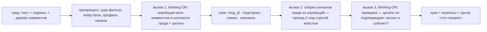

# План: харнес вокруг локальной Gemma-4-31B (thinking ON) для слоя сигналов — по образцу Anthropic

> Файл тимлида (по-русски, операторский). Черновик 26.08 вечером, пока исполнитель гонит
> `think-zero-shot`. Вступает в силу словом оператора ПОСЛЕ парной таблицы zero-shot: она —
> бейзлайн харнеса («eval before optimizing»). Источники Anthropic — в конце; факты о текущем
> харнесе — из `src/market_pulse/prompts.py`, `results/pass1_dev_pack.json`, `results/pass2_r2_pack.json`.

## 0. Главный вывод исследования

Мы три недели улучшали МОДЕЛЬ (адаптеры, промпт-варианты), не трогая ХАРНЕС — то, что модель
получает на вход, как её ответ проверяется и как результат собирается. Сравнение с ручным разбором
тимлида показывает: разница не в «уме» модели, а в том, что аналитик видел весь тред, а модель —
один комментарий и одну фразу темы. Ниже — что именно получает модель сегодня, что предлагает
Anthropic для таких систем, и как из этого собрать харнес v1 за два-три контракта.

## 1. Что модель получает сегодня (факты) против того, что имел аналитик

| | проход-1 v2 (`pass1_comment_gm4_v2`) | проход-2 (`pass2_thread_gm4_v1`) | читатель v5b (закрыт 17.08) | ручной разбор тимлида |
|---|---|---|---|---|
| вход | ОДИН комментарий + канал + одна фраза «topic» + entity-блок (часто пустой: `entities: []`) + 4 примера из ЧУЖИХ тредов (similarity 0.01–0.06) | пост + плоский список комментов с метками прохода-1 + entity-блок | пост + все комменты | пост, подпись к картинке, весь тред с ветками ответов, знание брендов и сетей, кодбук F/E/N |
| родитель/ветка ответа | нет | нет (плоский список) | частично | да |
| рассуждение | `enable_thinking: false` | false | false | да |
| форма инструкции | «закон» абстрактной прозой, 3 выдуманных примера без рассуждения | три «обязанности» в жёстком порядке (CoT-заменитель) | то же | кодбук + примеры с объяснением |
| проверка ответа | парсер JSON | скорер по голду | скорер | перечитывание, цитата рядом с выводом |
| результат | 68% согласия; ошибка «упоминает vs о чём» | бары 4/5 · 3/4 · красный | бар-1 2/5 | эталон |

Вывод: комментарий «Молоко із зеленню 😍» под постом-запросом рецептов из набора продуктов
неатрибутируем без поста — ни одной моделью. Это дефект харнеса, не модели.

## 2. Принципы Anthropic → наша задача

1. **Workflow, не агент** («Building effective agents»): шаги фиксированы (прочитать → атрибутировать
   → собрать сигналы → проверить) — детерминированный конвейер из LLM-вызовов, без
   самостоятельного «агента» и без инструментов. Паттерны: prompt chaining + evaluator-optimizer
   (одна итерация проверки), «start with the simplest solution».
2. **Контекст — как у аналитика** («Effective context engineering»): документ целиком в НАЧАЛЕ
   (пост, подпись, дерево комментов с `parent`), затем справочные блоки (сущности, профиль канала,
   кодбук), инструкции и схема ответа — в КОНЦЕ; XML-разметка секций; «правильная высота» системного
   промпта: роль + зачем + правила + примеры с объяснением, без прескриптивного CoT.
3. **Thinking-модели** (prompting best practices): рассуждение направляется высокоуровнево («перед
   ответом определи для каждого коммента, на что он отвечает и является ли названное имя субъектом
   или упоминанием»), самопроверка внутри рассуждения, бюджет рассуждения регистрируется.
4. **Цитата раньше вывода** (reduce hallucinations / long context): каждый сигнал и каждая атрибуция
   несут цитату и `msg_id`; разрешён ответ «ни о ком» / `unknown-brand`.
5. **Примеры** (multishot): 5–8 рабочих примеров с коротким объяснением, из размеченных строк ВНЕ
   оценочных тредов (правило контаминации уже в репо), в `<examples>`.
6. **Детерминированные проверки = хуки**: `msg_id` существует, цитата — подстрока треда, бренд из
   лексикона или `unknown-brand`, схема валидна, плюс-спам/скам-боты отфильтрованы правилами ДО модели.
7. **Инструменты не нужны** («Writing tools for agents»): для локальной 31B всё, что инструмент бы
   достал (сущности, профиль канала, подписи картинок), предвычисляется в контекст.
8. **Evals раньше оптимизации** (develop-tests): код-грейдеры быстрые и бесплатные; LLM-судья
   не нужен (локально — слабый), его место занимает слепая адъюдикация оператора на расхождениях.

## 3. Харнес v1 — архитектура

- **Рендеринг** (H1): один документ треда в XML: `<post>` (текст + подпись из caption-дампов),
  `<comments>` с `msg_id`, `parent`, ролью автора (магазин/пользователь), `<entities>`,
  `<channel_profile>` (аудитория из registry), `<codebook>` (4 субъекта с swap-тестом, 5 типов
  сигналов, шум), `<examples>`, инструкции и схема — последними. Части длинных тредов — по
  поддеревьям ответов, а не по счётчику строк.
- **Вызов 1** (H2): одна модель, один тред, thinking ON → список `{msg_id, subject_type,
  subject_id, stance, quote}` — это проход-1 с контекстом; при зелёном zero-shot на v2 — та же
  инструкция, поднятая на «высоту» (роль, зачем, примеры с объяснением).
- **Вызов 2**: существующий проход-2 (строгая власть) — не переписывается.
- **Вызов 3** (evaluator): «для каждого сигнала: подтверждает ли цитата тип/субъект/аспект?
  да/нет + причина»; «нет» → сигнал в `doubt`, не в агрегаты. Одна итерация, без переписывания.
- **Хуки** (H4): детерминированные проверки между вызовами; провал хука — строка в отчёте, не
  исключение.
- **Память между окнами** (позже): заметки по бренду/каналу — в агрегатном хранилище, не в промпте.
- **Сервинг** (после зелёного): vLLM с кэшем префикса (кодбук + системный промпт общие для всех
  тредов) и continuous batching — thinking умножает токены, кэш префикса возвращает ×3–5; «батч 1»
  остаётся законом только для гейтовых замеров.

## 4. Eval-харнес и петля разработки — главное изменение процесса

Сегодня каждая правка промпта = контракт → сессия → отчёт → приёмка ≈ сутки. Anthropic и Карпати
говорят одно: скорость = скорость петли generate→verify. Поэтому:

- **Dev-пак** (заморожен, $0 для грейдера): dev-200 + 8 тредов dev с метками; **holdout** (100 +
  16 референсных тредов) — не трогается до финального выстрела.
- **Грейдеры кодом**: согласие по 650 меткам (есть), бары референса (есть), + новые: валидность
  `msg_id`, подстрока цитаты, схема, `unknown-brand`, таблица флипов между прогонами.
- **Сессия итераций на тёплом поде** (новый тип контракта): оператор и исполнитель у терминала,
  под держится под капом сессии (например $5), каждая итерация = правка промпта/рендеринга →
  прогон dev-пака (~20–40 мин с thinking) → грейдер за секунды → следующая. 3–5 итераций в день
  вместо одной в сутки. Holdout закрыт; **один пре-регистрированный выстрел** на holdout закрывает
  вопрос — one attempt остаётся для бара, не для разработки.
- **Слепая адъюдикация** расхождений с эталоном — оператор, без подписи чьё чтение.

## 5. Чего НЕ строим

Агента с инструментами; дообучение (пока меток десятки); новых денежных рунгов; чекеров на отчёт;
LLM-судью локальной моделью; перестройку центра до появления материала.

## 6. Контракты (после таблицы zero-shot)

1. `harness-v1-prep` ($0): рендеринг треда (H1), хуки (H4), грейдеры, dev/holdout-паки с sha,
   промпт вызова 1 на «высоте» + примеры вне оценочных тредов, вызов 3; всё прогнано с фейковым
   клиентом; регистрация dev-петли (кап сессии, число итераций, что замораживается).
2. `harness-v1-dev` (тёплый под, кап $5, ASK-рунг): итерации на dev-паке до плато (правило
   остановки: две итерации без роста согласия ИЛИ кап); лучший промпт фиксируется sha.
3. `harness-v1-holdout` (один выстрел, кап $4): holdout-100 + 16 референсных тредов + остальные
   треды окна-1 при зелёном → материал для центра. Затем — перестройка центра вокруг «что говорят».
   Календарь: 4–6 дней. Деньги: ≈$10 — потолок цикла-2 потребует слова оператора.

## 7. Как таблица zero-shot меняет этот план

- thinking сам поднял dev-200 и бары (ячейка «упоминает → категория» ушла) → харнес v1 сокращается
  до H1 (контекст треда) + хуков; итераций меньше.
- thinking дал мало → дефицит контекста (H1) — главный кандидат; план как написан.
- thinking сломал парсинг/длину (обрезки `length`, время) → сначала бюджет рассуждения и рендеринг
  короче; vLLM раньше.

## Источники (official Anthropic)

Building effective agents — https://www.anthropic.com/engineering/building-effective-agents ·
Effective context engineering — https://www.anthropic.com/engineering/effective-context-engineering-for-ai-agents ·
Writing tools for agents — https://www.anthropic.com/engineering/writing-tools-for-agents ·
Prompting best practices (thinking, examples, long context, citations) —
https://platform.claude.com/docs/en/build-with-claude/prompt-engineering/claude-prompting-best-practices ·
Evals — https://platform.claude.com/docs/en/test-and-evaluate/develop-tests ·
Harness anatomy (system prompt · tools · hooks · subagents · memory) — https://code.claude.com/docs/en/how-claude-code-works
